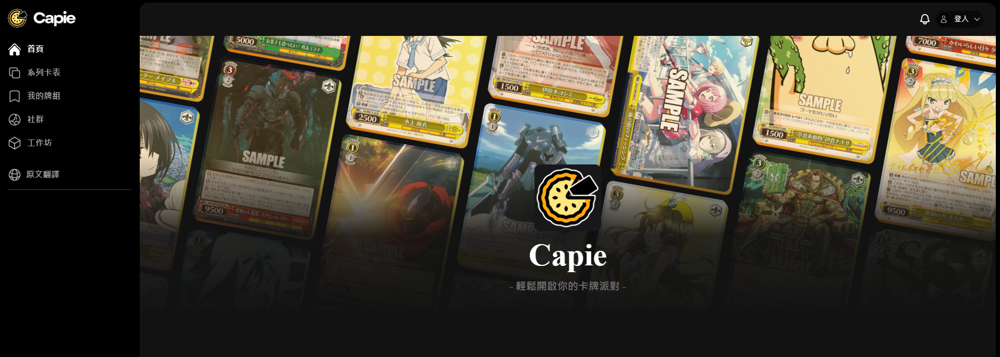
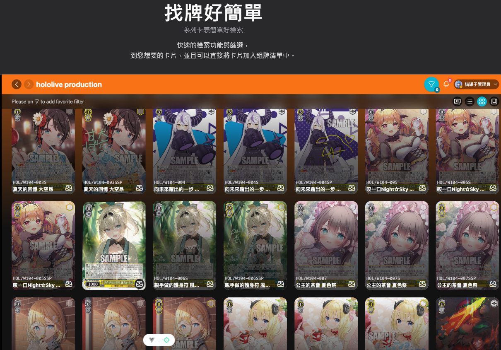
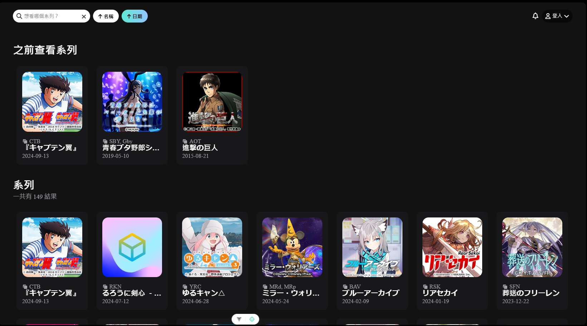
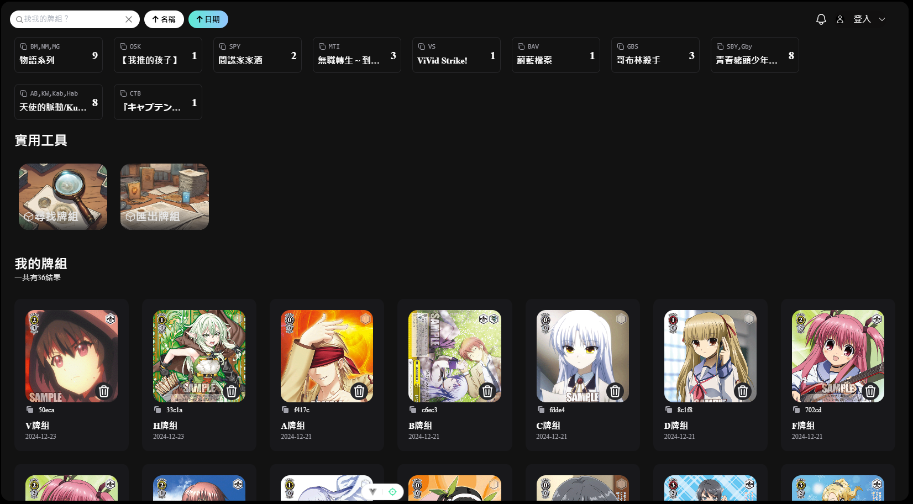

# 卡派Capie

## 主要畫面








以下將會引導你如何安裝此專案到你的電腦上。

## 取得專案

git clone https://github.com/capie2024/frontend

## 移動到專案內

```
cd frontend
```

## 安裝套件

```
npm install
```

### 運行專案

```sh
npm run dev
```

### 環境變數設定

請在終端機輸入 `cp .env.development.example`來複製 .env.example 檔案，並依據 `.env` 內容調整相關欄位。

### 開啟專案

在瀏覽器網址列輸入以下即可看到畫面

```sh
http://localhost:5173/
```

## 資料夾說明

- views - 畫面放置處
- components - 元件放置處
- modules - 模組放置處
- assets - 靜態資源放置處
  - css - css 檔案放置處
  - images - 圖片放置處

## 專案技術

- fancyapps/ui 5.0.36
- fortawesome/fontawesome-free 6.7.0
- paypal/paypal-js 8.1.2
- tinymce/tinymce-vue 6.1.0
- axios 1.7.7
- dayjs 1.11.13
- jspdf 2.5.2
- pinia 2.2.6
- sweetalert2 11.6.13
- swiper 11.1.15
- tinymce 7.6.0
- vue 3.5.12
- vue-router 4.4.5
- tailwindcss 3.4.15

## 第三方服務

- Google Login
- Paypal

## 專案介紹

卡派是一個線上的卡牌組牌工具，提供各種便利的功能，讓您可以輕鬆的組牌、分享牌組、查詢卡片等等。

### **首頁**

- 查看每日卡的輪播圖。
- 新系列的卡牌展示。
- 新的社群文章列表。

### **系列卡表**

- 查看各大系列的卡牌。
- 功能包括：
  - **先前查看的系列**
  - **搜尋欄**
  - **名稱排序**
  - **日期排序**
- 點進系列後可以點選卡牌生成自己的牌組，並提供複合式篩選功能。

### **我的牌組**

- 組完的牌組會存放於此。
- 功能包括：
  - **系列按鈕篩選**
  - **搜尋欄**
  - **名稱排序**
  - **匯出牌組**
  - **日期排序**

### **社群**

- 查看其他用戶新增的文章。
- 支援留言功能。
- 點選 **新增文章按鈕** 可建立自己的文章。

### **工作坊**

- 提供多種功能按鈕：
  - **英雄榜**
  - **每日卡**
  - **官方商品**
  - **卡片問答集**
  - **尋找牌組**
  - **匯出牌組**

### **英雄榜**

- 支援透過金流功能付費，從一般用戶升級成英雄會員。

## 聯絡作者

可以透過以下方式與我們聯絡

### 團隊成員

- 旻睿 :https://github.com/minjuilu
- 佳樺 :https://github.com/wuuhua
- 宗倫 :https://github.com/allen84324
- 代賢 :https://github.com/Wandaihsien
- 宜臻 :https://github.com/Enya-Wu
- 景淵 :https://github.com/Kenny1238
- 昱丞 :https://github.com/YuCheng07
